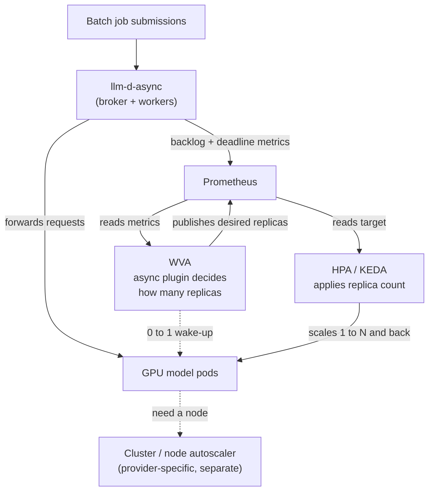

# Proposal: Async & Batch Autoscaling for llm-d

**Status:** Proposed
**Author:** Jacob Murry
**Date:** August 2026

> A concise, non-technical companion to the [Async Batch Autoscaling Roadmap](./async-queue-autoscaling-roadmap.md). This document makes the case for the work and sketches the shape of the solution; the roadmap holds the detailed design.

---

## The opportunity

llm-d autoscaling is built for interactive chat, where a warm GPU must always be ready to answer in under a second. A large and growing class of inference does not work this way. Batch and asynchronous jobs — recomputing recommendation profiles every hour, labeling a dataset overnight — care about **finishing by a deadline**, not about millisecond latency.

For these workloads, the priority is the opposite of interactive: **minimize infrastructure footprint**. Yet today, teams running them either keep GPUs powered on 24/7 between bursts, or write their own scaling scripts to fill the gap. llm-d does not serve this class of workload well — and that is the opportunity.

**Who this is for:** teams with scheduled or event-driven inference against completion windows measured in minutes-to-hours, who want to stop paying for idle accelerators.

**Representative use cases:**
- **Hourly recommendation refresh** — a few minutes of work each hour, then nothing until the next cycle.
- **Overnight dataset labeling** — hundreds of thousands of images captioned "by morning," with hours of slack to schedule the work.

---

## Why llm-d

- **Scale GPUs to zero.** Native `0 ↔ N` autoscaling returns replicas to zero between batches — no custom controllers required.
- **Deadline-aware, not latency-driven.** Because async jobs carry completion windows, llm-d can defer wake-ups and right-size against the actual deadline instead of racing to finish work nobody is waiting on.
- **One autoscaler for both worlds.** The same WVA engine serves interactive and batch traffic, so operators get a single scaling story instead of two parallel systems.
- **Governance built in.** Budget caps and quota policies give operators explicit control over batch GPU spend.

**Why now:** the hard prerequisite already exists. The `llm-d-async` component and the metrics this design consumes are already built. The remaining work is a focused, WVA-side plugin that turns those existing signals into scaling decisions — a bounded, high-leverage investment on top of infrastructure we already have.

---

## What we're building

A new **async-aware analyzer plugin** inside WVA. It reads the backlog and deadline signals that `llm-d-async` already publishes, decides how many GPU replicas the work needs, and hands that decision to the autoscaling machinery llm-d already uses.

The plugin slots into WVA's existing analyzer framework — no parallel decision path, no new engine. WVA stays the "brain" that decides; the standard Kubernetes autoscalers remain the "hands" that act.

---

## How it fits together

**The split that keeps this clean:** WVA decides *how many pods*; HPA/KEDA *apply* that count; the cluster's own node autoscaler provisions the *machines* underneath. Node provisioning is deliberately left to the provider (GKE, EKS, on-prem, etc.), so WVA stays portable across clouds. On GKE, for example, Custom Compute Classes can prefer cheap Spot machines and fall back to on-demand automatically — with no involvement from WVA.

---

## Milestones

Three sequential milestones, each shippable on its own.

### Milestone 1 — Wake on backlog (0 ↔ 1)
Start one GPU pod when async requests are waiting; return to zero once the queue drains. A cooldown knob lets operators tune how long a warmed pod stays available to absorb new arrivals — a good fit for long, predictable deadlines where work accumulates steadily. This is the foundation: reliable scale-to-zero for batch.

### Milestone 2 — Deadline-aware deferral (0 ↔ 1)
Don't wake up the moment work arrives — wake up when the *deadline* demands it. A job with a 24-hour window and 10 minutes of work shouldn't consume GPUs all night. WVA reads how close requests are to their deadlines and defers scale-up until the urgency window opens, while still reacting immediately to genuinely urgent requests.

### Milestone 3 — Right-sizing and governance (0 ↔ N)
When one pod can't finish in time, scale to as many as the deadline requires. WVA learns actual cold-start times to size accurately, and enforces budget/quota caps so batch GPU spend stays within operator-defined limits.

| | M1 | M2 | M3 |
| :--- | :--- | :--- | :--- |
| **Scale range** | 0 ↔ 1 | 0 ↔ 1 | 0 ↔ N |
| **Trigger** | Backlog | Backlog + deadline | Backlog + deadline + budget |
| **Timing** | Immediate | Deferred to deadline | Predictive & sized |
| **Governance** | — | — | Budget caps & policy |

---

## The ask

A focused engineering investment in a WVA-side plugin unlocks a new class of latency-insensitive workloads for llm-d, on top of infrastructure that already exists. See the [full roadmap](./async-queue-autoscaling-roadmap.md) for the detailed design, configuration schema, failure modes, and open questions.
