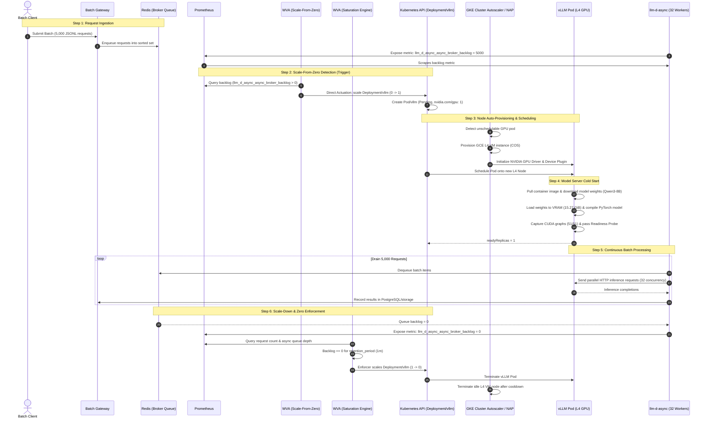
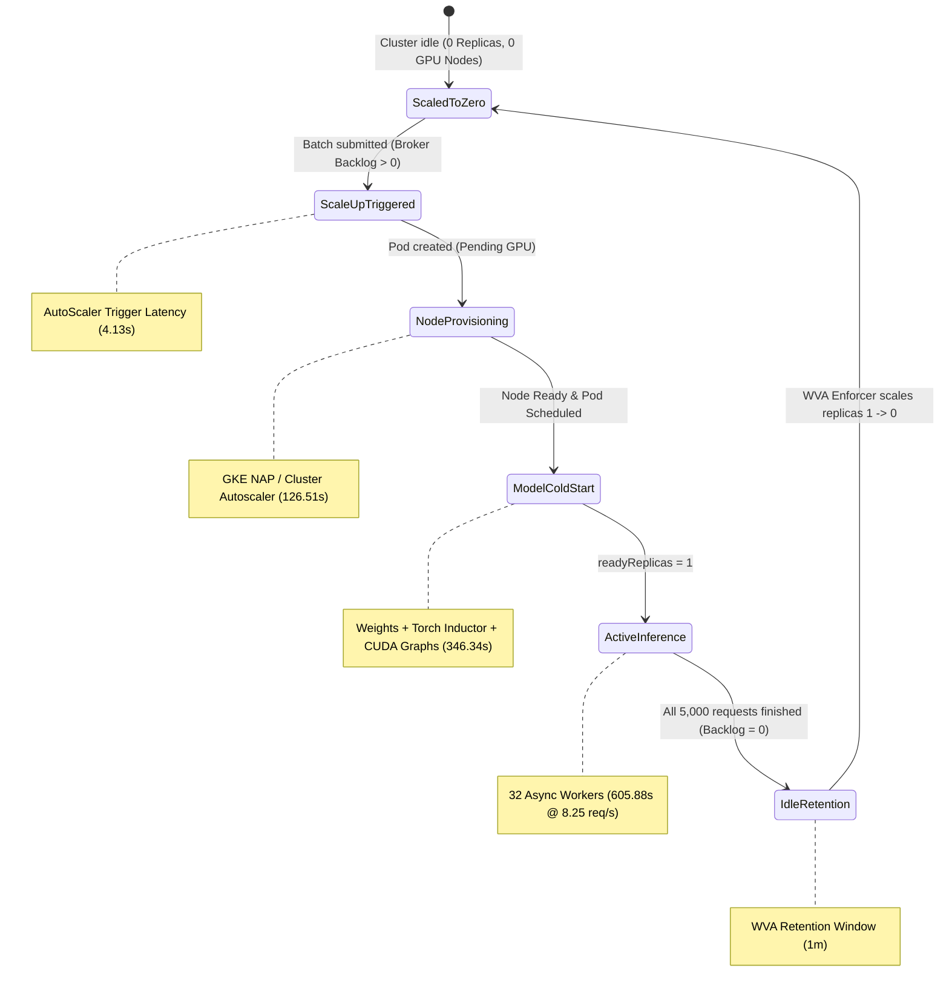

# Async Queue Autoscaling: Implementation Architecture, Pipeline Flow & Benchmark Report

This document details the async queue autoscaling integration in the **Workload Variant AutoScaler (WVA)**, including the complete codebase modifications, architectural sequence and state machine diagrams, step-by-step pipeline execution walkthroughs, and end-to-end benchmark results for a 5,000-request batch workload scaling from and to zero.

---

## 1. Overview & Objectives

In asynchronous and batch inference workflows (powered by `batch-gateway` and `llm-d-async`), incoming user requests are stored in durable broker queues (e.g., Redis sorted sets) rather than arriving as continuous synchronous HTTP streams to the model server.

Standard Kubernetes Horizontal Pod Autoscaler (HPA) cannot scale deployments to/from 0 replicas and relies primarily on synchronous metrics (CPU utilization, EPP HTTP request rates). To solve this:
1. **Scale From Zero ($0 \to 1$)**: When async requests enter the broker queue, WVA detects the backlog in Prometheus/Redis and triggers immediate direct actuation to scale the model `Deployment` from 0 to 1 replica.
2. **Dynamic Queue & Drain Time Modeling**: The `async_queue` analyzer calculates required capacity based on queue backlog, cooldown thresholds, and SLA drain times.
3. **Scale To Zero ($1 \to 0$)**: When all requests finish and queue backlog drops to 0, WVA evaluates traffic over an idle retention period and safely scales the `Deployment` back down to 0 replicas.

---

## 2. Autoscaling Pipeline Architecture & Workflow

### 2.1 End-to-End Sequence Diagram



---

### 2.2 Lifecycle State Machine



---

## 3. Code Modifications in WVA

The following files were created and modified in the `llm-d-workload-variant-autoscaler` repository:

```
llm-d-workload-variant-autoscaler/
├── cmd/
│   └── main.go                                                 # [MODIFIED] Wired AsyncQueueAnalyzer & promAPI
├── config/
│   └── base/
│       └── manager/
│           ├── deployment.yaml                                 # [MODIFIED] Controller image update
│           └── saturation-scaling-configmap.yaml               # [MODIFIED] Added async_queue configuration
├── internal/
│   ├── collector/
│   │   └── registration/
│   │       └── saturation.go                                   # [MODIFIED] Added async metric PromQL query
│   ├── engines/
│   │   ├── analyzers/
│   │   │   └── asyncqueue/                                     # [NEW PACKAGE]
│   │   │       ├── analyzer.go                                 # AsyncQueueAnalyzer implementation
│   │   │       ├── analyzer_test.go                            # Ginkgo unit test suite
│   │   │       ├── config.go                                   # Config parser & label filter
│   │   │       └── constants.go                                # Metric names, modes & thresholds
│   │   └── scalefromzero/
│   │       └── engine.go                                       # [MODIFIED] Prometheus backlog query & scale-up
└── docs/
    └── design/
        ├── async-queue-autoscaling-roadmap.md                  # [NEW] 3-Milestone autoscaling roadmap
        └── async-queue-autoscaling-implementation-and-benchmark.md # [NEW] Architecture & benchmark report
```

### 3.1 New Async Queue Analyzer Package (`internal/engines/analyzers/asyncqueue/`)

#### A. Constants & Modes (`constants.go`)
- **`ModeBinary` (`"binary"` - Default)**: Scale up to 1 replica when backlog $>0$, and down to 0 when backlog $=0$.
- **`ModeDrainTime` (`"drain_time"`)**: Calculates required capacity based on target SLA drain time: $\text{Demand} = \frac{\text{Backlog}}{\text{TargetDrainTime}}$.
- **Metrics**: Default `llm_d_async_async_broker_backlog` and fallback `llm_d_async_async_queue_depth`.
- **Thresholds**: `DefaultHighQueueThreshold = 50`, `DefaultMinQueueThreshold = 1`, `DefaultMinScaleDownAge = 1h`, `DefaultTargetDrainTime = 5m`, `DefaultPerReplicaRPS = 12.0`.

#### B. Config Parser & Label Filtering (`config.go`)
- Enables granular filtering by `queueName`, `poolName`, and `queueID`.
- **Wildcard / Multi-Queue Aggregation**: When `queueName: ""` or `poolName: ""` are empty, the analyzer sums across all queues and pools without requiring changes to metrics emitted by `llm-d-async`.

#### C. Demand Calculation & Cooldown (`analyzer.go`)
- Tracks `lastScaleDownTimes` per model to enforce `minScaleDownAge` cooldown to prevent flapping on small sporadic requests.
- Bypasses cooldown immediately when backlog exceeds `highQueueThreshold`.
- In `binary` mode: emits $\text{demand} = \text{perReplicaSupply} \times \text{scaleUpThreshold}$ to stabilize 1 replica during active processing.

---

### 3.2 Scale-From-Zero Engine Enhancement (`internal/engines/scalefromzero/engine.go`)

Injected Prometheus client `promAPI` and added PromQL queries in `processInactiveVariant`:
```go
if !pendingRequestExist && e.promAPI != nil {
    ctxTimeout, cancel := context.WithTimeout(ctx, 2*time.Second)
    defer cancel()
    query := fmt.Sprintf(
        `sum(inference_extension_flow_control_queue_size{target_model_name=%q}) ` +
        `or sum(inference_extension_flow_control_queue_size{model_name=%q,target_model_name=""}) ` +
        `or sum(llm_d_async_async_broker_backlog) ` +
        `or sum(llm_d_async_async_queue_depth)`,
        va.Spec.ModelID, va.Spec.ModelID,
    )
    val, _, err := e.promAPI.Query(ctxTimeout, query, time.Now())
    // If val > 0, triggers DirectActuator to scale Deployment 0 -> 1
}
```

---

### 3.3 Main Controller Wiring (`cmd/main.go`)

Registered `AsyncQueueAnalyzer` under name `"async_queue"` in the optimization engine and passed `promAPI` to `scalefromzero.Engine`:
```go
if err := engine.RegisterAnalyzer(asyncqueue.AnalyzerName, asyncqueue.NewAsyncQueueAnalyzer()); err != nil {
    return err
}
engine.SetPrometheusAPI(promAPI)
```

---

## 4. End-to-End Benchmark Results (5,000 Inference Requests)

### 4.1 Benchmark Configuration

| Parameter | Configuration Value |
| :--- | :--- |
| **Model** | `Qwen/Qwen3-8B` (8 Billion parameters) |
| **Hardware** | NVIDIA L4 GPU (24GB VRAM), GCE `g2-standard-8` |
| **Cluster Autoscaling** | GKE Node Auto-Provisioning (NAP) / Cluster Autoscaler |
| **Initial State** | **Cold Cluster** (0 L4 GPU Nodes, 0 `vllm` Pods, `spec.replicas = 0`) |
| **Batch Size** | **5,000 requests** (JSONL chat completion prompts, max 50 tokens) |
| **Async Concurrency** | 32 parallel worker routines in `llm-d-async` |
| **Scale-To-Zero Idle Window** | `retention_period: 1m` |

---

### 4.2 Full Lifecycle Latency Breakdown

```
===========================================================================
📊 FULL LIFECYCLE & STAGE-BY-STAGE LATENCY BREAKDOWN
===========================================================================
  Total Requests Processed:        5,000
  Overall Total Elapsed Time:      1,522.02s (25.37 minutes)
  Total Success Rate:              100.0% (5,000 succeeded, 0 failed)
===========================================================================
```

| Stage | Name | Duration (s) | Duration (min) | % of Total | Detailed Description |
| :---: | :--- | :---: | :---: | :---: | :--- |
| **1** | **AutoScaler Trigger Latency** | `4.13s` | `0.07m` | `0.3%` | Time from client batch submission until WVA scraped Prometheus and updated `Deployment/vllm` `spec.replicas` $0 \to 1$. |
| **2** | **Node Scale-Up & Scheduling** | `126.51s` | `2.11m` | `8.3%` | GKE Cluster Autoscaler / NAP detected pending GPU pod, requested new GCE L4 VM, booted COS, loaded NVIDIA driver, and scheduled pod. |
| **3** | **Model Server Cold Start** | `346.34s` | `5.77m` | `22.8%` | Container creation, Qwen3-8B weights loading into VRAM (15.27 GiB), PyTorch Inductor compilation, and 51 CUDA graphs capture. |
| **4** | **Processing Inference Batch** | `605.88s` | `10.10m` | `39.8%` | 32 async workers fed continuous batches to vLLM, draining 5,000 requests at a sustained **8.25 req/s** throughput. |
| **5** | **Scale Down to Zero** | `437.07s` | `7.28m` | `28.7%` | Backlog $= 0 \implies$ WVA evaluated 1-minute idle retention window and scaled `Deployment/vllm` replicas $1 \to 0$. |
| **—** | **Total Elapsed Time** | **`1,522.02s`** | **`25.37m`** | **`100.0%`** | **Complete cold-to-cold batch lifecycle** |

---

### 4.3 Key Benchmark Observations

1. **Fast Trigger Reaction (`4.13s`)**: The scale-from-zero engine reacts almost instantaneously to Redis broker backlog metrics scraped by Prometheus.
2. **Cloud Node Provisioning (`2.11m`)**: True cold-start from 0 VMs in the cloud requires ~2 minutes for VM allocation, kernel initialization, and GPU driver registration.
3. **Model Warmup vs Inference**: Model compilation and CUDA graphs capture (`346.34s`) represent a fixed one-time overhead per cold start; subsequent inference ran at high efficiency (**8.25 req/s**).
4. **Clean Zeroing**: Once the queue was fully drained, the deployment automatically scaled down to 0 replicas, freeing the L4 GPU node for GKE cluster autoscaler de-provisioning.

---

## 5. Configuration Example

To enable async queue autoscaling for a model in WVA, configure `wva-saturation-scaling-config`:

```yaml
apiVersion: v1
kind: ConfigMap
metadata:
  name: wva-saturation-scaling-config
  namespace: llm-d-demo
data:
  "Qwen/Qwen3-8B#llm-d-demo": |
    model_id: "Qwen/Qwen3-8B"
    namespace: "llm-d-demo"
    analyzers:
      - type: async_queue
        score: 1.0
        parameters:
          mode: "binary"                           # "binary" (0/1) or "drain_time" (multi-replica)
          queueName: "llm-d-async:requests:vllm-pool" # Empty string "" for wildcard across all queues
          poolName: "vllm-pool"                   # Empty string "" for wildcard across all pools
          highQueueThreshold: 50                   # Immediate scale-up threshold
          minQueueThreshold: 1                     # Threshold after cooldown
          minScaleDownAge: "1h"                    # Flapping cooldown window
          targetDrainTime: "5m"                    # SLA target drain duration
          defaultPerReplicaRPS: 12.0               # Estimated RPS per GPU replica
    scaleUpThreshold: 0.85
    scaleDownBoundary: 0.70
    enableLimiter: false
```

And configure `wva-model-scale-to-zero-config` for idle scale-down:

```yaml
apiVersion: v1
kind: ConfigMap
metadata:
  name: wva-model-scale-to-zero-config
  namespace: llm-d-demo
data:
  default: |
    enable_scale_to_zero: true
    retention_period: "1m"
```
