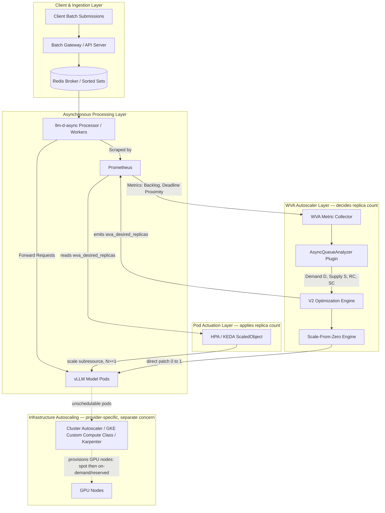

# Design Document: Roadmap for Asynchronous Batch Autoscaling

**Status:** Proposed (design under prototyping — no milestone shipped yet)
**Author:** Jacob Murry
**Date:** August 2026
**Target Components:** `llm-d-workload-variant-autoscaler` (WVA), `llm-d-async`, `batch-gateway`

---

## 1. Executive Summary

Asynchronous and batch LLM workloads differ fundamentally from interactive chat:
* **Loose vs. Strict SLAs:** Requests often carry completion windows (e.g. 1 hour, 24 hours) rather than strict sub-second TTFT/ITL targets.
* **Bursty Backlogs:** Batches arrive in large bursts (e.g. 5,000 requests at once) and queue in Redis broker sorted sets.
* **Heavy GPU Cold Starts:** Model weights, torch compilation, and CUDA graph capture can take 2–5 minutes on fresh accelerator nodes.
* **Cost Sensitivity:** Batch workloads are typically driven by infrastructure footprint rather than latency; keeping GPU clusters active 24/7 for intermittent traffic holds accelerators idle between bursts.

This document outlines the architecture and roadmap for integrating **`llm-d-async`** with **`llm-d-workload-variant-autoscaler` (WVA)** to enable intelligent, deadline-aware, cost-efficient autoscaling across three sequential milestones.

> **Implementation status:** The `llm-d-async` component — including the broker, workers, and the Prometheus metrics this design consumes — already exists. The gap this roadmap closes is entirely on the **WVA side**: no async-aware autoscaling plugin is implemented yet. None of the three milestones below are implemented in WVA today; Milestone 1 is currently being prototyped. The milestones describe *target* WVA behavior; where a mechanism already has a partial substrate in WVA, this is called out explicitly in [§4 Current Implementation Substrate](#4-current-implementation-substrate). Verbs in the milestone sections describe intended behavior, not shipped behavior.

---

## 2. The llm-d Value Proposition

Today, WVA optimizes for interactive traffic, where a warm pod must always be ready to serve sub-second requests. That model does not fit batch and asynchronous inference, where the defining requirement is minimizing infrastructure footprint rather than latency. This roadmap extends llm-d to a class of workloads it does not currently serve well.

### Target customer

Organizations that want to **minimize infrastructure costs** and have **no low-latency requirement** for a meaningful share of their inference. These are teams running scheduled or event-driven inference jobs against completion windows measured in minutes-to-hours, not milliseconds — and who today keep GPUs running continuously or maintain home-grown scaling scripts to work around the gap.

### Representative use cases

* **Hourly recommendation-profile updates:** A platform recomputes user recommendation profiles once an hour from the most recent interactions. The job runs for a few minutes, then no capacity is needed until the next hour. With scale-to-zero, GPU replicas exist only during the drain window and return to zero once the backlog is empty.
* **Large image dataset labeling for training/archival:** A batch of hundreds of thousands of images must be captioned/labeled for a training corpus or archive. The deadline is loose (e.g. "by tomorrow morning"), so WVA can defer the wake-up within the deadline window and size replicas to meet it, rather than racing to finish work no one is waiting on.

### Why llm-d (differentiators)

* **Scale-to-zero for GPUs:** Native `0 ↔ N` autoscaling returns GPU replicas to zero between batches, without operators writing custom controllers.
* **Deadline-aware decisions:** Because llm-d-async carries completion windows, WVA can defer and right-size against the actual SLA (Milestones 2–3) — provisioning GPUs only when the deadline requires them. WVA layers this deadline-aware decision logic on top of the standard actuation mechanisms it already uses (HPA/KEDA); those mechanisms scale on a queue-depth threshold and have no notion of a per-request deadline on their own.
* **One autoscaler across interactive and batch:** The same WVA/V2 optimization engine serves both traffic classes, so operators get a single, consistent scaling story instead of two parallel systems.
* **Resource governance built in (Milestone 3):** Budget caps and quota policies give operators explicit, configurable control over batch GPU consumption.

### Funding rationale

The prerequisite (`llm-d-async` and its metrics) already exists; the remaining work is a WVA-side plugin that turns those signals into scaling decisions. This is a high-leverage investment: a bounded, incremental effort on top of existing infrastructure that unlocks a new segment of latency-insensitive workloads for llm-d.

---

## 3. Notation

| Symbol | Meaning | Config source |
| :--- | :--- | :--- |
| `PRC` | Per-Replica Capacity — sustained request throughput a single model replica can drain (req/s). | `defaultPerReplicaRPS` |
| `τ_up` | Scale-up utilization threshold — target utilization above which capacity is added: `RC = max(0, D/τ_up − anticipatedSupply)`. Default 0.85. | `scaleUpThreshold` |
| `τ_down` | Scale-down utilization boundary — target utilization below which capacity is safe to release: `SC = max(0, S − D/τ_down)`. Default 0.70. The `τ_down < τ_up` gap is a deliberate hysteresis deadband against flapping. | `scaleDownBoundary` |
| `RC` | Required Capacity — additional capacity the engine determines must be added. | derived |
| `SC` | Spare Capacity — surplus capacity eligible for scale-down. | derived |
| `D` / `S` | Aggregate Demand / Supply across replicas, in the V2 optimization engine's units. | derived |
| `ΔT_deadline` | Effective deadline proximity extracted from the deadline-proximity histogram (§7). | derived |
| `T_cold_start` | Time to provision a node, pull the image, load weights, and compile CUDA graphs. | `staticColdStartDuration` (learned in M3) |

---

## 4. Current Implementation Substrate

This section grounds the roadmap in what WVA already provides, so reviewers can distinguish net-new async work from reuse of existing machinery.

* **Scale-from-zero engine (exists, not async-aware):** `internal/engines/scalefromzero` performs 0→1 actuation today by locating zero-replica VariantAutoscalings and scaling them via the actuator. Its pending-work signal is the **interactive EPP flow-control queue metric** (`inference_extension_flow_control_queue_size`), *not* an async broker backlog. Milestone 1 would add an async-broker-backlog signal alongside (or in place of) this.
* **V2 optimization engine (exists):** `internal/engines/saturation/engine_v2.go` computes Required/Spare Capacity (`RC`/`SC`) and Total Supply/Demand from pluggable analyzers, combining them into a weighted composite score. The RC/SC and Demand/Supply math referenced by the milestones targets this engine. It is currently fed by the `throughput`, `saturation_v2`, and `queueingmodel` analyzers — **there is no `async_queue` analyzer yet**; that is a Milestone 1 deliverable.
* **Metric-driven actuation via HPA/KEDA (exists):** In steady state WVA does not patch replica counts directly. It emits a desired-replica metric (`wva_desired_replicas`) to Prometheus, and an external autoscaler — a Kubernetes HPA or a KEDA `ScaledObject` — reads that metric and drives the deployment's scale subresource. Only the scale-from-zero engine patches `spec.replicas` directly (for the 0→1 hop, which HPA cannot perform). See [§6 Component Roles](#6-component-roles--responsibilities).
* **Static quota limiter (exists, unrelated to M3 governance):** `internal/config/quota_limiter.go` enforces a **static GPU-count cap** per accelerator type at cluster/namespace scope. This is *not* the Redis batch-budget governance proposed in Milestone 3; that would be net-new.

> **Net-new for this roadmap (all WVA-side):** the `async_queue` analyzer, WVA-side consumption of the already-emitted `llm_d_async_*` metrics, the entire async config schema in [§8.4](#84-configuration-schema), deadline/urgency logic, cold-start learning, and Redis quota governance. The metrics themselves are produced by `llm-d-async` today and are not part of this work.

---

## 5. Architecture & System Flow



---

## 6. Component Roles & Responsibilities

The system deliberately separates two axes: the **decision** to scale from the **act** of scaling, and **pod** scaling from **infrastructure** scaling. Each component owns one responsibility.

| Component | Layer | Responsibility |
| :--- | :--- | :--- |
| Batch Gateway / API server | Ingestion | Accepts client batch submissions and enqueues requests into the Redis broker. |
| Redis broker (sorted sets) | Ingestion | Durable, ordered queue of pending async requests. Part of `llm-d-async`. |
| `llm-d-async` processor / workers | Processing | Dequeue requests, forward them to model pods, and emit backlog + deadline-proximity metrics. |
| vLLM model server pods | Processing | Run inference. This is the unit WVA scales `0 ↔ N`. |
| Prometheus | Observability | Scrapes `llm-d-async` metrics and WVA's emitted `wva_desired_replicas` metric. |
| WVA — collector + `async_queue` analyzer + V2 engine | Decision | Reads backlog/deadline metrics and computes the desired replica count. Publishes it; does not apply it (except the 0→1 hop below). |
| WVA scale-from-zero engine | Pod actuation (0→1) | Directly patches the scale subresource `0 → 1`, because HPA cannot scale up from zero. |
| HPA / KEDA `ScaledObject` | Pod actuation (≥1) | Reads `wva_desired_replicas` and drives the deployment's scale subresource for steady-state scale-up/down. |
| Cluster Autoscaler / GKE Custom Compute Class / Karpenter | Infrastructure autoscaling | Provisions and removes GPU **nodes** so scheduled pods have somewhere to run. Provider-specific and **out of scope** for WVA (see §6.1). |

The essential split: **WVA is the brain, HPA/KEDA are the hands** (with the scale-from-zero engine handling the single 0→1 hop the hands can't reach). WVA never scales on a raw threshold — it publishes a computed target that the external autoscaler applies.

### 6.1 Scope boundary: pod autoscaling vs. infrastructure autoscaling

Every component above the infrastructure row scales **pods**. Provisioning the **nodes** those pods run on is a separate concern owned by the cluster/infrastructure autoscaler, and is intentionally **out of scope** for WVA and this roadmap.

This separation is a deliberate design choice:

* **Pod scaling is agnostic to how infrastructure is provisioned.** llm-d customers run on many cluster and cloud providers (GKE, EKS, AKS, OpenShift, on-prem), each with its own node-provisioning mechanism. Coupling pod-scaling decisions to any single provider's node API would fragment the autoscaler and lock customers into one environment.
* **The contract between the layers is standard Kubernetes scheduling.** WVA/KEDA raise the replica count → new pods go `Pending` if no node has a free GPU → the infrastructure autoscaler observes the unschedulable pods and provisions nodes. Scale-down reverses the flow. Neither layer needs to know the other's internals.

**On GKE:** customers can use **Custom Compute Classes** to autoscale infrastructure to accommodate model server pods. A Custom Compute Class defines an ordered list of machine/node preferences, so the cluster can prefer cheaper **Spot** GPU machines first and automatically fall back to **on-demand** (and then **reserved**) capacity when Spot is unavailable or preempted — all transparently to WVA, which only ever changes replica counts.

### 6.2 Variants in async-driven autoscaling

WVA supports multiple **variants** per model — model servers that serve the same `ModelID` but differ in hardware/cost. In code today a variant is an in-memory record (the `VariantAutoscaling` CRD was removed) synthesized from annotated HPAs / KEDA `ScaledObject`s. The optimizer distinguishes variants by **accelerator type** (`AcceleratorName`), a **flat per-variant cost** (the `llm-d.ai/variant-cost` annotation, default `10.0`), role, and measured per-replica capacity. Note that serving-config dimensions (tensor parallelism, batch size, quantization) are **not** modeled as structured fields today; they surface only implicitly through measured per-replica capacity.

**How async demand maps to variants.** The `async_queue` analyzer produces demand for a `ModelID`. When several variants can serve that model, WVA's cost-aware optimizer selects the **most cost-efficient** variant (lowest `Cost / PerReplicaCapacity`) to satisfy the demand and sheds the most expensive first. Selection is a greedy / fair-share heuristic, not an MILP.

**Why this is an especially good fit for batch.** Latency-insensitive batch is the ideal workload for aggressive cheapest-variant selection. Interactive traffic often needs a faster, pricier accelerator to hold TTFT/ITL SLAs; batch carries no such penalty, so WVA can push demand onto the cheapest variant that can still drain the backlog in time. In async terms, the **deadline** (M2/M3) — not latency — becomes the constraint that bounds how cheap/slow a variant WVA may choose: a variant is admissible while `T_est_drain(variant) + T_cold_start(variant) ≤ ΔT_deadline`.

### 6.3 Capacity type: separate variants vs. infrastructure-managed fallback

A natural question for cost-driven batch: should **Spot** and **on-demand** capacity be modeled as *separate variants* with different costs, or as a *single variant* whose node source the infrastructure layer chooses (§6.1)?

**Model A — one variant, infrastructure chooses (current default).** A single variant maps to one accelerator type; the provider's node autoscaler (e.g. GKE Custom Compute Class) prefers Spot and falls back to on-demand/reserved transparently. WVA sees one variant and one cost and never learns which capacity source served a pod.
* *Pros:* preserves the provider-agnostic separation of §6.1; works today with no WVA changes; portable across clouds.
* *Cons:* WVA cannot cost-optimize between Spot and on-demand (they look identical to it) and cannot express a Spot-first preference itself.

**Model B — Spot and on-demand as separate variants (proposed).** Two variants for the same model, the Spot variant carrying a lower `variant-cost`. WVA's cost-aware optimizer would then naturally prefer Spot and treat on-demand as the pricier alternative.
* *Pros:* Spot preference becomes explicit and WVA-visible; enables WVA-driven fallback (below).
* *Cons / gaps in the current model:*
  * Variants are keyed by accelerator type, and Spot vs on-demand of the **same** GPU resolve to the **same** `AcceleratorName` — so they are **not distinguishable as variants today**. Model B requires adding **capacity type as a first-class variant dimension** (distinct from accelerator type), with separate quota pools per capacity type.
  * It couples WVA to a provider concept (capacity type), partially eroding the §6.1 agnosticism — acceptable only as an opt-in dimension.

**Can workload-variant fallback cover a failed infrastructure autoscaler?** Not today — and only partially even under Model B. WVA is a **desired-replica producer, not a scheduler**: it emits per-variant target replica counts and leaves placement to Kubernetes + KEDA/HPA. It has **no feedback loop for capacity that fails to materialize** — it does not react to pods stuck `Pending` / unschedulable (the one pending-replica mechanism that exists *suppresses* scale-up for stabilization; it is not a failover). So if the infrastructure autoscaler cannot obtain a Spot node, WVA will not notice and will not redirect demand to an on-demand variant; the batch simply waits for infrastructure.

Making variant fallback real is **net-new design** requiring two pieces:
1. **A capacity-failure signal** — detecting replicas stuck `Pending` / unschedulable beyond a timeout, or consuming a provisioning-failure event/metric.
2. **A rebinding step** in the async analyzer that shifts target replicas from the stalled (cheap) variant to a fallback (pricier) variant when the signal fires, and rebalances back when Spot recovers.

This also interacts with cold-start learning (§3.2): a failed Spot provision inflates observed cold-start time and would need to be excluded or bucketed by capacity type. Because it makes WVA react to infrastructure state, it is a deliberate, scoped exception to §6.1 and should be an explicit opt-in, not default behavior.

**Recommendation.** Default to **Model A** for M1–M3 as scoped: it keeps the clean pod/infra separation, needs no WVA changes, and GKE Custom Compute Classes already deliver Spot-first economics for batch. Treat **Model B + variant fallback** as a future capability, gated on (a) capacity type as a variant dimension and (b) the capacity-failure feedback loop above. Without (b), Model B's "fallback" is illusory, because WVA cannot observe Spot exhaustion.

---

## 7. Roadmap Milestones

### Milestone 1: Binary (0 ↔ 1) Queue-Depth Driven Autoscaling
> **Status:** Planned — prototyping in progress. Not yet implemented.

#### Goals & Scope
* Activate 1 GPU model server when pending requests exist in the async queue.
* Scale to 0 when the backlog is completely drained and the model is idle.
* Prevent multi-pod scale-out during batch execution by ignoring drain-time sizing heuristics.

#### Target scenario — long, predictable deadlines with steady accumulation
Milestone 1 directly addresses workloads whose deadlines are **long and predictable** and whose requests **build up gradually** over that window. Rather than encoding deadlines explicitly (that arrives in Milestone 2), M1 lets operators approximate the desired behavior with the cooldown knob: `minScaleDownAge` is tuned to roughly the interval over which they are willing to let requests accumulate — i.e. how long a warmed model stays available to drain new arrivals before returning to zero — which in turn governs how frequently the system cycles capacity up. A **longer** cooldown accumulates more requests per wake-up and scales up less often (fewer cold starts, more batching); a **shorter** cooldown reacts sooner at the cost of more frequent cold starts. For a predictable deadline, an operator picks a cooldown comfortably shorter than the deadline so accumulated work is drained well within the completion window.

#### Key Mechanics (proposed)
1. **Backlog Extraction:**
   * Scrape the async backlog metric already emitted by `llm-d-async` (`llm_d_async_async_broker_backlog` / `llm_d_async_async_queue_depth`) from Prometheus.
   * Support exact queue matching (`queueName`, `poolName`) or wildcard aggregation across all queues/pools.
2. **Binary Demand Function** — evaluated per reconcile, mutually exclusive branches:
   * **Cold (`Active == 0` and `Backlog > 0`):** Demand = `PRC × τ_up`, setting Required Capacity `RC = PRC` and triggering `ΔN = +1`. Here `PRC` is only a unit for expressing "one pod of demand" to the V2 engine — its *magnitude* is inert in M1 (any positive value yields the same 0→1 result); its value first matters in M2 (`T_est_drain`) and M3 (`N_target`). The `defaultPerReplicaRPS` knob is therefore grouped under M2 in [§8.4](#84-configuration-schema).
   * **Warm (`Active ≥ 1` and `Backlog > 0`):** Demand clamped to 1-pod capacity (`RC = 0`, `SC = 0`), holding steady at 1 replica (no multi-pod scale-out in M1).
   * **Drained (`Backlog == 0`):** Demand = 0, producing Spare Capacity `SC = TotalSupply`, eligible for scale-down subject to the cooldown below.
3. **Scale-From-Zero Actuation:**
   * Reuse `scalefromzero.Engine`, extending its pending-work signal to include the async backlog metric, and directly update `Deployment.spec.replicas` from 0 → 1. (Today this engine keys off the EPP flow-control queue metric only — see [§4](#4-current-implementation-substrate).) The subsequent hold-at-1 and scale-down are applied by HPA/KEDA reading `wva_desired_replicas` — see [§6](#6-component-roles--responsibilities).
4. **Anti-Thrashing Cooldown:**
   * Configurable `minScaleDownAge` prevents flapping on small request streams unless backlog exceeds `highQueueThreshold`.

---

### Milestone 2: Deadline-Urgency Driven (0 ↔ 1) Autoscaling
> **Status:** Planned. Not yet implemented in WVA. Consumes the deadline-proximity histogram provided by `llm-d-async` ([#400](https://github.com/llm-d/llm-d-async/pull/400)).

#### Problem Statement
In Milestone 1, any backlog immediately wakes up a GPU pod. For a batch with a 24-hour SLA submitted at night, waking up a GPU instantly is wasteful if the entire batch takes only 10 minutes to process and the deadline is 23 hours away. Conversely, a high-priority request with a 5-minute deadline must trigger immediate scale-up even if the backlog is only 1 request.

#### Core Metric: Histogram of Deadline Proximity
Integrate the histogram metric introduced in [`llm-d-async#400`](https://github.com/llm-d/llm-d-async/pull/400):

`llm_d_async_async_deadline_proximity_millis_bucket`

* **Histogram Quantile Query:** WVA evaluates a configurable percentile (e.g. `P10`, or `min`) to extract the effective deadline proximity (`ΔT_deadline`):
  ```promql
  histogram_quantile(0.10, sum(rate(llm_d_async_async_deadline_proximity_millis_bucket[5m])) by (le, queue_name, pool_name))
  ```
  Using a configurable percentile (default `P10` with fallback to `min`) ensures outlier poison-pill requests do not induce thrashing while safeguarding the bulk of the queue before SLA expiration.

#### Decision Logic
The autoscaler evaluates both **Queue Depth** and **Histogram Deadline Proximity**:

```
                       ┌───────────────────────────────┐
                       │     Async Queue Evaluation     │
                       └───────────────┬───────────────┘
                                       │
                    ┌──────────────────┴──────────────────┐
                    ▼                                      ▼
           Backlog == 0 Requests                  Backlog > 0 Requests
                    │                                      │
                    ▼                                      ▼
             Demand = 0 req/s                Check Urgency Conditions:
             (Scale to Zero)                1. P_quantile(Deadline) <= UrgencyThreshold
                                            2. OR Backlog >= HighQueueThreshold
                                            3. OR TimeSinceArrival >= MaxDeferredWait
                                                          │
                                     ┌────────────────────┴────────────────────┐
                                     ▼                                          ▼
                                Urgent = TRUE                            Urgent = FALSE
                                     │                                          │
                                     ▼                                          ▼
                          Demand = 1 Pod Capacity                        Demand = 0 req/s
                           (Trigger Scale-Up 0->1)                     (Defer Scale-Up / Sleep)
```

#### Urgency Threshold Calculation
```
UrgencyThreshold = T_cold_start + T_est_drain + T_safety_buffer
```
* `T_cold_start`: Time to provision node, pull image, load weights, compile CUDA graph (configured statically or learned in memory, e.g. `4m`).
* `T_est_drain`: Estimated time to process pending requests (`Backlog / PRC`).
* `T_safety_buffer`: Operational safety margin (e.g. `2m`).

If `ΔT_deadline > UrgencyThreshold` and backlog is below the high threshold, WVA **suppresses scale-up**, keeping the cluster at 0 replicas until the urgency window is entered.

---

### Milestone 3: Dynamic Multi-Replica (0 ↔ N) Sizing, Cold-Start Learning & Quota Governance
> **Status:** Proposed future state. Not yet implemented.

#### 3.1 Predictive Multi-Replica Sizing (0 ↔ N)
When batch volume is high or deadlines are approaching rapidly, 1 replica may be insufficient to complete processing before deadline breach. Milestone 3 enables scaling up to `N` replicas (`N ≤ MaxReplicas`):

```
Available Processing Time:  T_avail  = max(10s, ΔT_deadline - T_cold_start)
Required Drain Rate:        D_req    = Backlog / T_avail
Target Replicas:           N_target = min(MaxReplicas, ceil( D_req / (PRC × τ_up) ))
```

#### 3.2 In-Memory Cold-Start Learning with Static Fallback
Rather than requiring external state storage, WVA maintains an **in-memory exponential moving average and `P95` estimator** initialized with static configuration fallback:
* **Initial State / Cold Start Fallback:** Uses `staticColdStartDuration` (e.g. `4m`) on controller boot or cache miss.
* **Online Calibration:** Tracks actual elapsed time between the scale-from-zero trigger (`spec.replicas: 0 -> 1`) and the first healthy ready signal (`readyReplicas: 1` + `/health` OK).
* **Decaying Moving Average:**
  ```
  T_cold_start_hat = α · T_observed + (1 - α) · T_cold_start_hat
  ```
* **Resilience:** Resets gracefully to the configured static fallback upon controller restarts.

> **Design tension (intentional):** §3.2 deliberately avoids external state for cold-start learning (tolerating loss on restart), while §3.3 adds Redis-backed quota that *requires* durable external state. The distinction: cold-start estimates are cheap to re-learn and safe to lose, whereas budget accounting must survive restarts to be enforceable. Redis is already present in the async architecture, so no new dependency is introduced.

#### 3.3 Redis-Backed Quota & Configurable Policy Governance
Batch processing often operates under budget caps (e.g. max $500/month or max 10 GPU-hours per day). Milestone 3 integrates quota governance into scaling decisions:
* **Time/Cost Bucket in Redis:** WVA queries remaining GPU-second quota from Redis before executing scale-up.
* **Configurable Quota Exhaustion Policies (`onQuotaExceeded`):**
  * `hold-zero`: Completely holds cluster at 0 replicas until quota replenishes.
  * `cap-at-one`: Limits concurrency to at most 1 replica for best-effort trickle processing.
  * `allow-spot-only`: Restricts scaling exclusively to preemptible/spot node pools.
  * `unrestricted`: Emits a quota-exceeded warning metric/event without blocking scaling.

> **Relationship to the existing static quota limiter:** WVA already enforces a static GPU-*count* cap (`internal/config/quota_limiter.go`). This proposal is orthogonal — a *time/cost budget* rather than a concurrency cap — and the interaction of the two (which binds first) is an open question (see [§10](#10-open-questions--risks)).

---

## 8. WVA Analyzer Plugin Design

The async autoscaling behavior is delivered as a new **analyzer plugin** (`async_queue`) inside WVA's existing analyzer framework, feeding the shared V2 optimization engine rather than introducing a parallel decision path.

### 8.1 Plugin model & registration

WVA analyzers are pluggable scorers registered at controller startup. The existing analyzers — `throughput`, `saturation_v2`, and `queueingmodel` — are registered in `cmd/main.go` and selected per-workload by the `type` field of an entry in the saturation-scaling ConfigMap (`AnalyzerScoreConfig`). Because the analyzer `type` is a free-form string, adding `async_queue` is purely additive: register the new analyzer alongside the others and it becomes selectable via `type: async_queue`, with no change to the engine or to existing analyzers.

### 8.2 Analyzer contract

The `async_queue` analyzer implements the same interface as the existing analyzers:
* **Inputs:** the current system snapshot (active replicas, per-replica capacity) plus the async signals read from Prometheus — backlog depth (M1) and the deadline-proximity histogram (M2).
* **Outputs:** it emits Demand/Supply and the derived Required/Spare Capacity (`RC`/`SC`) into the V2 engine ([`internal/engines/saturation/engine_v2.go`](../../internal/engines/saturation/engine_v2.go)), which combines all enabled analyzers into a weighted composite score and produces the final replica target. The async analyzer supplies the binary/deadline/dynamic demand functions from [§7](#7-roadmap-milestones); it does **not** actuate (actuation is HPA/KEDA + the scale-from-zero engine, per [§6](#6-component-roles--responsibilities)).
* **Scoring weight:** the `score` field weights this analyzer's contribution relative to others when more than one is enabled for a workload.

### 8.3 Parameter parsing & validation

Today `AnalyzerScoreConfig` recognizes only the well-known keys (`type`, `name`, `enabled`, `score`, `scaleUpThreshold`, `scaleDownBoundary`) and folds everything else through a free-form `parameters` map whose unknown keys are **silently ignored**. Part of Milestone 1 is a typed parameter struct for `async_queue` that parses and **validates** the fields in [§8.4](#84-configuration-schema) — durations, thresholds, and quantiles — rejecting malformed or unrecognized keys instead of dropping them silently, so misconfiguration surfaces at load time rather than as silent no-ops.

### 8.4 Configuration Schema

> All fields below are **proposed**. None are parsed by WVA today (see [§8.3](#83-parameter-parsing--validation)). Adding an `async_queue` analyzer that validates these parameters is part of Milestone 1.

> **On `scaleUpThreshold` / `scaleDownBoundary` (`τ_up` / `τ_down`):** these are existing V2-engine knobs, honored by the shared engine's universal post-step for every analyzer (including `async_queue`). They define a target-utilization deadband (default 0.85 / 0.70) whose gap provides anti-flap hysteresis. In **Milestone 1** the binary demand function forces demand to either a full pod's capacity or zero, so this band is largely **inert** — anti-thrashing in M1 is handled by the time-based `minScaleDownAge` cooldown instead. The thresholds become load-bearing in **Milestone 3**, where dynamic sizing (`N_target ∝ PRC × τ_up`) depends on them directly.

```yaml
apiVersion: v1
kind: ConfigMap
metadata:
  name: saturation-scaling-config
  namespace: llm-d-demo
data:
  default: |
    scaleUpThreshold: 0.85
    scaleDownBoundary: 0.70
    analyzers:
      - type: async_queue
        score: 1.0
        parameters:
          # --- Milestone 1 Settings ---
          mode: "binary"                           # "binary" (0<->1) | "deadline_aware" | "dynamic_drain"
          queueName: "llm-d-async:requests:vllm-pool"
          poolName: "vllm-pool"
          highQueueThreshold: 50                   # Immediate scale-up bypass
          minQueueThreshold: 1
          minScaleDownAge: "1h"                    # Scale-down cooldown

          # --- Milestone 2 Settings (Deadline-Urgency) ---
          defaultPerReplicaRPS: 12.0               # Per-replica drain rate; magnitude first matters here (T_est_drain = Backlog / PRC)
          deadlineMetricName: "llm_d_async_async_deadline_proximity_millis"
          deadlineQuantile: 0.10                   # Evaluate P10 deadline proximity from histogram
          staticColdStartDuration: "4m"            # Baseline cold start buffer (and fallback)
          safetyBufferDuration: "2m"               # Margin before deadline
          maxDeferredWaitDuration: "6h"            # Maximum time to defer cold batch

          # --- Milestone 3 Settings (Dynamic Sizing & Governance) ---
          maxReplicas: 5                           # Allow scaling 0 <-> N
          enableColdStartLearning: true            # In-memory learning with static fallback
          coldStartDecayAlpha: 0.2
          quota:
            enabled: true
            redisEndpoint: "redis-master:6379"
            tenantQuotaKey: "quota:tenant-default"
            maxDailyGPUHours: 24.0
            onQuotaExceeded: "cap-at-one"          # "hold-zero" | "cap-at-one" | "allow-spot-only" | "unrestricted"
```

---

## 9. Comparison Matrix Across Milestones

| Capability | Milestone 1 | Milestone 2 (Deadline-Urgent) | Milestone 3 (Full Dynamic & Quota) |
| :--- | :--- | :--- | :--- |
| **Replica Scale Bounds** | 0 ↔ 1 | 0 ↔ 1 | 0 ↔ N (≤ `MaxReplicas`) |
| **Trigger Signal** | Backlog Queue Depth | Backlog Depth + Deadline Histogram (`P10`) | Backlog + Deadline Histogram + Token Budget |
| **Scale-Up Timing** | Immediate upon backlog | Deferred until SLA urgency window | Predictive & dynamically sized |
| **Cold-Start Awareness** | Static cooldown | Static cold-start offset in SLA math | In-memory learned `P95` with static fallback |
| **Multi-Replica Scaling** | Disabled (holds at 1) | Disabled (holds at 1) | Enabled — `ceil( D_req / (PRC × τ_up) )` |
| **Cost / Quota Governance** | None | Deferral saves idle GPU time (side effect) | Redis budget check with configurable action policy |

---

## 10. Open Questions & Risks

1. **Metric-name coupling.** The `async_queue` analyzer must match the names and label set (`queue_name`, `pool_name`) that `llm-d-async` already emits; these should be referenced from a shared constant rather than duplicated as config defaults. (The doubled `async_async_` prefix is `llm-d-async`'s existing convention, not a typo to fix here.)
2. **Scale-from-zero signal source.** Should M1 replace the EPP flow-control queue signal in `scalefromzero.Engine` with the async backlog metric, run both, or gate by analyzer type? Mixing interactive and batch signals in one engine risks cross-talk.
3. **Interaction with the existing static GPU-count quota limiter.** When both the static count cap and the M3 Redis time/cost budget are active, which binds, and how are conflicts surfaced to operators?
4. **Cold-start learning cold-start.** After a controller restart the learned estimate is lost and falls back to static config; for long-idle batch clusters, the estimator may rarely converge. Is per-model persistence worth the added state?
5. **Deadline histogram staleness.** `rate(...[5m])` over a bursty batch queue may be empty between bursts, yielding `NaN`/no data for `histogram_quantile`. Define the fallback (treat as non-urgent? most-urgent?).
6. **Wildcard aggregation vs. per-pool decisions.** Aggregating backlog across pools can mask a single hot pool; per-pool decisioning multiplies reconcile cost. Which is the M1 default?
7. **Cold-start coupling to infrastructure autoscaling.** `T_cold_start` includes node-provisioning time, which is owned by the (out-of-scope) infrastructure autoscaler and varies by provider and capacity type (e.g. Spot vs. on-demand on GKE Custom Compute Classes). Should the learned estimate be bucketed by capacity type, or treated as a single blended value?
8. **When (if ever) to invest in Model B + variant fallback (§6.3).** Modeling Spot/on-demand as separate variants requires capacity type as a new variant dimension *and* a capacity-failure feedback loop before its fallback is real. Is the added coupling to infrastructure worth it over letting the provider's node autoscaler handle Spot-first fallback (Model A)?

---

## 11. Failure Modes & Degradation

| Failure | Impact | Proposed Behavior |
| :--- | :--- | :--- |
| Prometheus unreachable / metric absent | No backlog or deadline signal | Fail safe: do **not** scale to zero on missing data; hold last known replica count within `minScaleDownAge`. |
| Redis quota store unreachable (M3) | Budget cannot be verified | Configurable: default to `hold-zero` (fail-closed on spend) vs. `unrestricted` (fail-open); document the trade-off. |
| Deadline histogram empty between bursts | `histogram_quantile` returns no data | Treat as non-urgent and rely on backlog + `maxDeferredWaitDuration` as the backstop. |
| Cold-start estimate wildly wrong | Late scale-up → SLA breach, or early scale-up → waste | Clamp learned estimate to `[staticColdStartDuration × 0.5, × N]`; alert on repeated deadline breaches. |
| Actuation succeeds but pod never becomes ready | Stuck at replicas=1, no drain | Emit event/metric; the ready-signal timeout feeds back into cold-start learning as an outlier (excluded). |
| Replica raised but no GPU node available | Pod stays `Pending`; infra autoscaler must provision a node | Out of WVA's control by design (§6.1); `T_cold_start` accounts for node provisioning, and the ready-signal timeout guards against indefinite waits. |

---

## 12. Testing Strategy

* **Unit:** `async_queue` analyzer demand function across the three M1 branches (cold/warm/drained); urgency-threshold math (M2); `N_target` sizing including the `max(10s, …)` and `ceil` boundaries (M3); quota-policy branch selection (M3).
* **Integration:** analyzer → V2 engine → RC/SC composite scoring, with synthetic Prometheus fixtures for backlog and deadline histograms (including empty/stale series).
* **E2E:** exercised via `make` targets on the Kind lifecycle (see `docs/developer-guide/testing.md`); validate 0→1→0 on a seeded async backlog, and deferral behavior under a slack deadline. All images fully-qualified (no docker.io).
* **Soak/anti-thrash:** verify no flapping under a trickle stream below `highQueueThreshold` across `minScaleDownAge`.

---

## 13. Security Considerations

* **Redis quota store (M3):** requires authenticated, least-privilege access; the tenant quota key must be namespaced per tenant to prevent cross-tenant budget read/modify. TLS to the broker endpoint. Treat `redisEndpoint` credentials as secrets, not ConfigMap plaintext.
* **Metric label trust:** `queue_name` / `pool_name` labels drive scaling decisions; ensure they originate from trusted `llm-d-async` exporters, not client-influenced input, to avoid scaling manipulation.
* **RBAC:** steady-state scaling is delegated to HPA/KEDA and needs no new WVA permissions; the scale-from-zero path patches the scale subresource directly, which WVA is already granted. No new cluster-scoped permissions should be needed for M1/M2. M3 quota read introduces an outbound Redis dependency only.

---

## 14. Key Design Decisions

1. **Separate pod autoscaling from infrastructure autoscaling (§6.1):** WVA scales pods only and stays agnostic to the node-provisioning layer, so customers can run on any cluster/cloud provider (e.g. GKE Custom Compute Classes for Spot-first node provisioning) without WVA changes.
2. **Delegate actuation to HPA/KEDA, reserve direct patching for 0→1:** WVA publishes a desired-replica metric and lets the external autoscaler apply it, keeping one consistent actuation path with interactive traffic; only the scale-from-zero hop is patched directly.
3. **Default to infrastructure-managed capacity fallback, not variant-per-capacity-type (§6.3):** Spot/on-demand selection is left to the provider's node autoscaler (Model A). Modeling capacity type as separate variants (Model B) and WVA-driven fallback is deferred until WVA gains a capacity-type variant dimension and a capacity-failure feedback loop — without which WVA, as a desired-replica producer, cannot observe Spot exhaustion.
3. **Histogram quantile metric for deadlines (M2):** Consuming `llm_d_async_async_deadline_proximity_millis_bucket` as a Prometheus histogram lets WVA compute quantiles (default `P10`) to protect the majority of requests while remaining immune to isolated outlier deadlines.
4. **Configurable quota exhaustion policy (M3):** Behavior on budget exhaustion is operator-selectable via `quota.onQuotaExceeded` (`hold-zero`, `cap-at-one`, `allow-spot-only`, `unrestricted`) rather than hard-coded.
5. **In-memory cold-start learning with static fallback (M3):** Learned estimates live in-memory on the controller and initialize from `staticColdStartDuration`, giving online adaptation without new CRD/database state — accepting loss on restart as a deliberate trade-off (see §3.2).
6. **Reuse the V2 optimization engine (M1+):** The async analyzer emits `RC`/`SC`/Demand into the existing V2 engine rather than introducing a parallel decision path, keeping one scoring pipeline.
